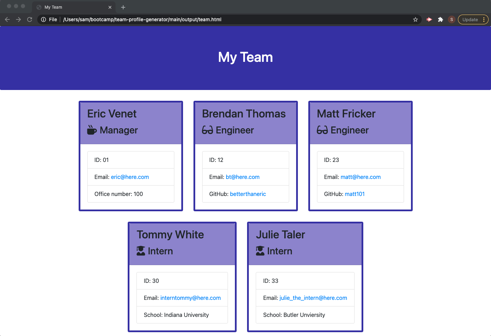

# Team Profile Generator

 ## Description
  This command line application generates an engineering team contact page
  
  
  
  ## Table of Contents
  * [Installation](#installation)
  * [Usage](#usage)
  * [License](#license)
  * [Contributing](#contributing)
  * [Tests](#tests)
  * [Questions](#questions)
  
  ## Installation
  This application is run in Node.js.  To install, please download the files from the repository and run “npm i” from the command line to install the dependencies.  
  
  ## Usage
  Once installed, you trigger the program at your command line with the command: “node app.js”.  The application will prompt you for information about each team member, allowing you to enter as many as you would like. A table will show your full team after each entry is completed.  Once you are done, a "team.html" file will be generated.
  
  
  [Link to Video Walkthrough](https://drive.google.com/file/d/1E2bXoUsyfDmPYJOb4Ogjrnb4gzx0BBCz/view)
  ## License
  MIT
  
  ## Tests
 There are tests for the class libraries that can be run with the command "npm test" after the dependencies have been installed in the previous steps.
  
  ## Questions
  If you have any questions, please send them to me through GitHub or email.

  Github Username: sfunk11

  [borley1@gmail.com](mailto:borley1@gmail.com)
